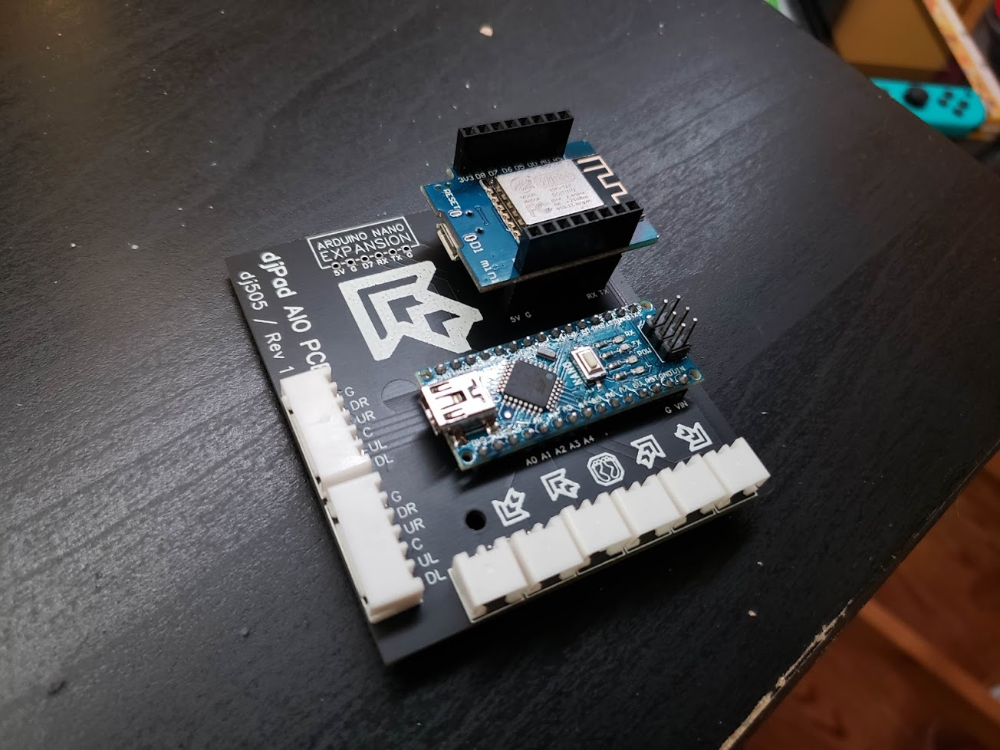

# djPad
Open source, accessible, and hopefully inexpensive velostat based PIU pad design, for beginners and experts alike
---

  Please consider supporting if you found this project helpful! 
  

# Features
- Wifi hotspot for web based sensitivity adjustment (code by [skogaby](https://github.com/skogaby), modified CSS by me)
- Lighting and IO support via custom PCB; Arduino Nano can output to any kind of input device, such as a PIUIO (or [PIUIO clone](https://github.com/racerxdl/piuio_clone/tree/simple/), keyboard, or controller via the digital pins (separate controller board required!)
- Doubles/2nd player pad support via custom PCB

# Parts List
- 2 x Arduino Nano (one per pad, only one required for singles)
- 1 x Wemos D1 Mini
- 1 x [All-in-one PCB](PCB/Gerber)
- 1 x Doubles/2nd player expansion board (only for doubles setup, coming soon!)
- JST XH connectors **(single pad)**
  - 6 x 2 pin JST XH right angle connectors
  - 3 x 6 pin JST XH right angle connectors
- JST XH connectors **(double pad)**
  - 11 x 2 pin JST XH right angle connectors
  - 6 x 6 pin JST XH right angle connectors

# Images

# Credits
- Arduino/ESP8266 code - [Skogaby](https://github.com/skogaby/velostatdancecrew2k19/)
- cyberm4d, Xenesus, Astro, and [everyone else who's helped support the project!](https://ko-fi.com/dj505piu)
